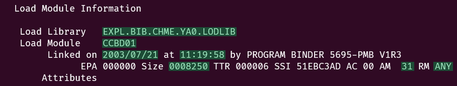
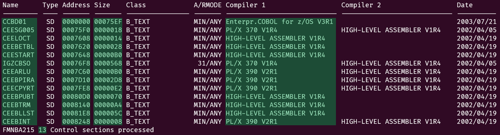
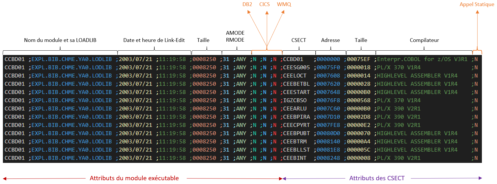

# ViewLoadModule
VLM signifie &laquo;View Load Module&raquo; il s'agit d'une focntion de IBM File Manager pour z/OS.

L'objectif de ce projet est de fournir un outil dédié à l'extraction spécifique de caractéristiques des modules IBM z/OS, lesquels sont stockés dans des LOADLIBS. Ce processus d'extraction découle de l'analyse préalable effectuée au moyen de la fonction **VLM d'IBM File Manager for z/OS**, constituant ainsi la source essentielle de données de ce projet.

# Structure du fichier à analyser
Un en-tête de page que l'on retrouve après chaque saut de page
```
1IBM File Manager for z/OS
```

Un en-tête de fichier avec les différentes instructions File Manager utilisées
```
0$$FILEM VLM DSNIN=EXPL.BIB.CHME.YA0.LODLIB,
 $$FILEM MEMBER=*,
 $$FILEM SUMMARY=NO,
 $$FILEM FUNCTION=PRINT,
 $$FILEM XLABEL=YES,
 $$FILEM DATEMASK=YYYY/MM/DD,
 $$FILEM SORTBY=ADDRESS
```

Un début de section &laquo;Load Module Information&raquo; suivi de diverses lignes attributs
```
  Load Module Information

   Load Library   EXPL.BIB.CHME.YA0.LODLIB
   Load Module    CCBD01
        Linked on 2003/07/21 at 11:19:58 by PROGRAM BINDER 5695-PMB V1R3
              EPA 000000 Size 0008250 TTR 000006 SSI 51EBC3AD AC 00 AM  31 RM ANY
       Attributes
```

Suit le tableau des CSECT qui compose le module. Prêtez attention à la dernière ligne qui débute par ```C'FMNBA215'``` et qui est suivie du nombre de CSECT.
```
 Name      Type Address Size    Class            A/RMODE Compiler 1                   Compiler 2                   Date
 --------- ---- ------- ------- ---------------- ------- ---------------------------- ---------------------------- ----------
 CCBD01     SD  0000000 00075EF B_TEXT           MIN/ANY Enterpr.COBOL for z/OS V3R1                               2003/07/21
 CEESG005   SD  00075F0 0000018 B_TEXT           MIN/ANY PL/X 370 V1R4                HIGH-LEVEL ASSEMBLER V1R4    2002/04/05
 CEELOCT    SD  0007608 0000014 B_TEXT           MIN/ANY HIGH-LEVEL ASSEMBLER V1R4                                 2002/04/19
 CEEBETBL   SD  0007620 0000028 B_TEXT           MIN/ANY HIGH-LEVEL ASSEMBLER V1R4                                 2002/04/19
 CEESTART   SD  0007648 00000B0 B_TEXT           MIN/ANY HIGH-LEVEL ASSEMBLER V1R4                                 2002/04/19
 IGZCBSO    SD  00076F8 0000568 B_TEXT            31/ANY PL/X 370 V1R4                HIGH-LEVEL ASSEMBLER V1R4    2002/04/05
 CEEARLU    SD  0007C60 00000B0 B_TEXT           MIN/ANY PL/X 390 V2R1                HIGH-LEVEL ASSEMBLER V1R4    2002/04/19
 CEEBPIRA   SD  0007D10 00002D8 B_TEXT           MIN/ANY PL/X 390 V2R1                HIGH-LEVEL ASSEMBLER V1R4    2002/04/19
 CEECPYRT   SD  0007FE8 00000E2 B_TEXT           MIN/ANY PL/X 390 V2R1                HIGH-LEVEL ASSEMBLER V1R4    2002/04/19
 CEEBPUBT   SD  00080D0 0000070 B_TEXT           MIN/ANY HIGH-LEVEL ASSEMBLER V1R4                                 2002/04/19
 CEEBTRM    SD  0008140 00000A4 B_TEXT           MIN/ANY HIGH-LEVEL ASSEMBLER V1R4                                 2002/04/19
 CEEBLLST   SD  00081E8 000005C B_TEXT           MIN/ANY HIGH-LEVEL ASSEMBLER V1R4                                 2002/04/19
 CEEBINT    SD  0008248 0000008 B_TEXT           MIN/ANY PL/X 390 V2R1                HIGH-LEVEL ASSEMBLER V1R4    2002/04/19
 FMNBA215 13 Control sections processed
```

# Règles de gestion

## Détection des sections

Le fichier doit être découpé en sections. Une section commence avec une ligne contenant &laquo;Load Module Information&raquo; et se termine avec une ligne débutant par &laquo;FMNBA215&raquo;. Ainsi, ces paires de lignes sont associées, et le nombre de sections correspond au nombre d'apparitions du début de section, qui est équivalent au nombre de fins de section.

## Identification des Lignes d'une section

Toutes les lignes comprises entre le début et la fin de section sont regrouppées au sein d'une même structure de données.

## Filtrage des lignes

- Les lignes vides et celles composées uniquement d'espaces doivent être ignorées ;
- Les lignes contenant les motifs ci-dessous doivent être ignorées :
  - ```'$$FILEM'```
  - ```'IBM File Manager for z/OS'```
  - ```'Attributes'```
  - ```'Name Type|---------'```

## Spécificités de certaines lignes

Dans certains fichiers IBM Mainframe le premier caractère de la ligne est un caractère de commande, qui ici devra être ignoré :
- "0" indique un saut de ligne
- "1" indique un saut de page

La dernière ligne __non vide__ de la section &laquo;Load Module Information&raquo; peut prendre différentes formes :
```
0      Attributes
0      Attributes RF RN RU
0      Attributes    RN RU
0      Attributes    RN RU    NX
0      Attributes       RU
0      Attributes       RU       OL
       Attributes
       Attributes             NX
       Attributes RF RN RU
       Attributes    RN RU
       Attributes    RN RU    NX
       Attributes    RN RU       OL
       Attributes    RN RU          TS
       Attributes       RU
       Attributes       RU    NX
       Attributes       RU       OL
       Attributes                   TS
```

Le tableau des CSECT peut être vide et le nombre de CSECT sera valorisé à zéro :
```
 Name      Type Address Size    Class            A/RMODE Compiler 1                   Compiler 2                   Date
 --------- ---- ------- ------- ---------------- ------- ---------------------------- ---------------------------- ----------
 FMNBA215 0 Control sections processed
```

L'information &laquo;Compiler 1&raquo; et/ou &laquo;Compiler 2&raquo; du tableau des CSECT peut ne pas être renseignée :
```
 Name      Type Address Size    Class            A/RMODE Compiler 1                   Compiler 2                   Date
 --------- ---- ------- ------- ---------------- ------- ---------------------------- ---------------------------- ----------
 AACCLOCK   SD  0000000 0007D1A B_TEXT           MIN/ANY Enterpr.COBOL for z/OS V4R1                               2019/12/16
 @ST00001   SD  0007D20 00004D0 B_TEXT           MIN/ANY C/C++ for z/OS V2R2                                       2019/12/16
 @@DLL      SD  00081F0 0000088 B_TEXT           MIN/ANY C/C++ for z/OS V2R0                                       2019/12/16
 @@PPA2     SD  0008278 000000C B_TEXT           MIN/ANY                                                           UNKNOWN
 @@DLLI     SD  0008288 000000C B_TEXT           MIN/ANY                                                           UNKNOWN
 @@XINIT@   SD  0008298 0000004 B_TEXT           MIN/ANY Enterpr.COBOL for z/OS V4R1                               2019/12/16
 @@INIT@    SD  00082A0 00004FC B_TEXT           MIN/ANY Enterpr.COBOL for z/OS V4R1                               2019/12/16
 DSNAA      SD  00087A0 0000100 B_TEXT            31/ANY PL/X 390 V2R4                HIGH-LEVEL ASSEMBLER V1R6    2010/01/08
 DSNTIAR    SD  00088A0 00002B9 B_TEXT            31/ANY HIGH-LEVEL ASSEMBLER V1R6                                 2010/01/08
 DSNALI     SD  0008B60 0000310 B_TEXT            31/ANY PL/X 390 V2R4                HIGH-LEVEL ASSEMBLER V1R5    2010/08/19
 DSNHADD2   SD  0008E70 0000058 B_TEXT            31/ANY HIGH-LEVEL ASSEMBLER V1R6                                 2010/01/08
 @@GETFN    SD  0008EC8 000000A B_TEXT           MIN/ANY HIGH-LEVEL ASSEMBLER V1R6                                 2015/03/04
 DSNHADDR   SD  0008ED8 0000058 B_TEXT            31/ANY HIGH-LEVEL ASSEMBLER V1R6                                 2010/01/08
 DSNHMVHW   SD  0008F30 000001C B_TEXT            31/ANY HIGH-LEVEL ASSEMBLER V1R6                                 2010/01/08
 CBCSG003   SD  0008F50 0000050 B_TEXT           MIN/ANY HIGH-LEVEL ASSEMBLER V1R6                                 2015/03/05
 @@C2CBL    SD  0008FA0 000000A B_TEXT           MIN/ANY HIGH-LEVEL ASSEMBLER V1R6                                 2015/03/04
 CEESG003   SD  0008FB0 000012B B_TEXT           MIN/ANY HIGH-LEVEL ASSEMBLER V1R6                                 2015/03/04
 CEESG005   SD  00090E0 0000018 B_TEXT           MIN/ANY PL/X 390 V2R4                HIGH-LEVEL ASSEMBLER V1R6    2015/10/01
 CEEBETBL   SD  00090F8 0000028 B_TEXT           MIN/ANY HIGH-LEVEL ASSEMBLER V1R6                                 2015/03/04
 CEESTART   SD  0009120 00000B0 B_TEXT           MIN/ANY HIGH-LEVEL ASSEMBLER V1R6                                 2015/03/04
 IGZCBSO    SD  00091D0 0000580 B_TEXT            31/ANY PL/X 390 V2R4                HIGH-LEVEL ASSEMBLER V1R6    2015/03/04
 CEEARLU    SD  0009750 00000B8 B_TEXT           MIN/ANY PL/X 390 V2R4                HIGH-LEVEL ASSEMBLER V1R6    2015/03/04
 CEEBPIRA   SD  0009808 00002A0 B_TEXT            31/ANY PL/X 390 V2R4                HIGH-LEVEL ASSEMBLER V1R6    2015/03/04
 CEECPYRT   SD  0009AA8 00000E2 B_TEXT           MIN/ANY PL/X 390 V2R4                HIGH-LEVEL ASSEMBLER V1R6    2015/03/04
 CEEBPUBT   SD  0009B90 0000070 B_TEXT           MIN/ANY HIGH-LEVEL ASSEMBLER V1R6                                 2015/03/04
 CEEBTRM    SD  0009C00 00000A4 B_TEXT           MIN/ANY HIGH-LEVEL ASSEMBLER V1R6                                 2015/03/04
 CEEBLLST   SD  0009CA8 000005C B_TEXT           MIN/ANY HIGH-LEVEL ASSEMBLER V1R6                                 2015/03/04
 CEEBINT    SD  0009D08 0000008 B_TEXT           MIN/ANY PL/X 390 V2R4                HIGH-LEVEL ASSEMBLER V1R6    2015/03/04
 FMNBA215 28 Control sections processed
```

## Barre de Progression

Implémentez une barre de progression des traitements par défaut. Toutefois, elle doit pouvoir être désactivée au besoin pour permettre une exécution dite &laquo;silencieuse&raquo;.

## Paramètres en Ligne de Commande {#args}

Par défaut, le programme traite le fichier ```./vlm.txt``` situé dans le répertoire courant. Cependant, cette configuration est ajustable, permettant à l'utilisateur de spécifier l'emplacement et le nom du fichier à traiter.

Le programme affiche par défaut une barre de progression des traitements. Toutefois, un paramètre correspondant est disponible pour donner à l'utilisateur la possibilité d'inhiber cette fonctionnalité, optant ainsi pour un mode d'exécution &laquo;silencieux&raquo;.

Le programme produit par défaut un résultat au format CSV avec le caractère point-virgule comme séparateur de champs. Cette configuration est également ajustable, permettant à l'utilisateur de spécifier une alternative à ce caractère.

Une aide en ligne pour l'utilisation du programme est intégrée.

## Traitement du tableau des CSECT

Toutes les CSECT qui ne font pas référence au COBOL, à l'Assembleur ou au PL/X seront ignorées.

## Extraction des données d'une section

- Le nom de la LOADLIB
- Le nom du module exécutable
- La date de Link-Edit du module exécutable
- L'heure de Link-Edit du module exécutable
- La taille du module exécutable
- L'AMODE et le RMODE du module exécutable



À cela s'ajoutent les informations des CSECT. Pour chacune :

- Le nom de la CSECT 
- L'adresse de la CSECT par rapport au début du module exécutable
- La taille de la CSECT
- Le compilateur utilisé pour compiler cette CSECT

Attention il faut aussi récupérer le nombre total de CSECT constituant le module exécutable.



Certaines informations doivent être déduites et représentées sous forme d'indicateurs à deux états, **'Y'** pour Oui et **'N'** pour Non :
- Est-ce un module exécutable nécessitant une connexion CICS ?
- Est-ce un module exécutable nécessitant une connexion DB2 ?
- Est-ce un module exécutable nécessitant une connexion WMQ ?

Requiert une connexion CICS si un STUB CICS est présent dans le module exécutable, c'est-à-dire si une CSECT porte l'un des noms suivants :
- ```DFHEAG``` : pour les programmes Assembleur sans l'option LEASM
- ```DFHELII``` : pour les programmes C, C++, COBOL, PL/I et Assembleur avec l'option LEASM
- ```DFHEAI0``` : pour les programmes Assembleur avec l'option LEASM qui utilisent des registres de base
- ```DFHEAI1``` : pour les programmes Assembleur avec l'option LEASM qui utilisent des registres de base
            et qui ont besoin d'un accès direct aux blocs de contrôle CICS
- ```DFHEAI2``` : pour les programmes Assembleur avec l'option LEASM qui utilisent des registres de base et qui ont besoin d'un accès direct aux blocs de contrôle CICS et aux registres de sauvegarde CICS

Requiert une connexion DB2 si un STUB DB2 est présent dans le module exécutable, c'est-à-dire si une CSECT porte l'un des noms suivants :
- ```DSNALI``` : pour les programmes COBOL, PL/I ou Assembleur en liaison statique et en mode batch
- ```DSNCLI``` : pour les programmes C, C++, Java ou REXX en liaison dynamique et en mode batch
- ```DSNELI``` : pour les programmes COBOL, PL/I ou Assembleur en liaison statique et en mode online (CICS ou IMS)
- ```DSNHLI``` : pour les programmes C, C++, Java ou REXX en liaison dynamique et en mode online (CICS ou IMS)

Requiert une connexion MQUEUE SERIE si un STUB MQ est présent dans le module exécutable, c'est-à-dire si une CSECT porte l'un des noms suivants :
- ```CSQBSTUB``` : pour les programmes COBOL, PL/I ou Assembleur en liaison statique et en mode batch
- ```CSQBSTUC``` : pour les programmes C, C++, Java ou REXX en liaison dynamique et en mode batch
- ```CSQBSTUE``` : pour les programmes COBOL, PL/I ou Assembleur en liaison statique et en mode online (CICS ou IMS)
- ```CSQBSTUF``` : pour les programmes C, C++, Java ou REXX en liaison dynamique et en mode online (CICS ou IMS)

En complément, il est nécessaire de représenter à l'aide d'un indicateur à deux états, **'Y'** pour Oui et **'N'** pour Non, la situation où l'une des CSECT incluses dans le module exécutable correspond à un développement réalisé par LCL. Si tel est le cas, une référence à la CSECT sera également trouvée dans le fichier sous la forme d'un module exécutable, en opposition aux références de CSECT développées par IBM, telles que les STUB CICS, DB2, WMQ, ou les CSECT IGZ* correspondant à des modules COBOL, ainsi que les CSECT CEE* correspondant à des modules du Language Environment, etc.

# Appel Statique versus Appel Dynamique

Un appel de module peut être soit statique soit dynamique, et cela concerne la manière dont le programme appelant (ou client) fait référence et exécute le code d'un autre module (ou sous-programme).

## Appel de Module Statique

Dans un appel de module statique, la liaison entre le programme appelant et le module appelé se fait au moment de la compilation. Cela signifie que le compilateur résout les adresses des sous-programmes appelés et génère un code exécutable spécifique à ces adresses. Les adresses des sous-programmes sont fixées au moment de la compilation et ne changent pas pendant l'exécution.

Avantages de l'appel de module statique :

- **Performances :** Les appels de modules sont plus rapides car les adresses sont résolues à la compilation ;
- **Contrôle :** Le programme appelant a un contrôle total sur les adresses des modules appelés.

Inconvénients de l'appel de module statique :

- **Flexibilité :** Les adresses sont figées à la compilation, ce qui peut rendre difficile la modification dynamique des modules.

## Appel de Module Dynamique

Dans un appel de module dynamique, la liaison entre le programme appelant et le module appelé se fait au moment de l'exécution. Les adresses sont résolues à l'exécution, permettant une plus grande flexibilité.

Avantages de l'appel de module dynamique :

- **Flexibilité :** Les adresses sont résolues à l'exécution, offrant une plus grande flexibilité pour modifier ou remplacer des modules ;
- **Extensibilité :** Permet d'ajouter de nouveaux modules sans avoir à recompiler le programme appelant.

Inconvénients de l'appel de module dynamique :

- **Performance :** L'appel de modules dynamiques peut entraîner une surcharge de performance car les adresses sont résolues à l'exécution.

# Gestion des exceptions

- La gestion des paramètres en ligne de commande ;
- Le fichier à traiter ;
- Le nombre de sections doit être égal au nombre de débuts de section, ce qui est équivalent au nombre de fins de section ;
- Une section est obligatoirement délimitée par une paire de début de section et de fin de section associée.

Une exception doit être déclenchée dès qu'une erreur est détectée. Si cette erreur survient lors du traitement du fichier, cette exception devra retourner suffisamment d'éléments pour permettre la localisation de la ligne en cours de traitement au moment de l'erreur :

- Le numéro de la section en cours
- Le numéro de la dernière ligne du fichier lue

# Résultat

Le résultat doit être affiché sur la sortie standard au format CSV (Comma-Separated Values). Cependant, le caractère séparateur par défaut ne sera pas une virgule, traditionnellement utilisée aux États-Unis, mais le point-virgule. Cf. [Paramètres en Ligne de Commande](#args)

Le résultat peut se diviser en trois colonnes :
- les données extraites des attributs ;
- les données extraites du tableau des CSECT ;
- les données déduites un ensemble d'indicateurs à deux états.

En raison de la nature variable du nombre de CSECT par module, c'est cette table des CSECT qui servira de pivot. Ainsi, pour un module exécutable, il y aura autant de lignes qu'il y a de CSECT présentes dans le tableau des CSECT, et bien évidemment, chaque ligne d'un même module présentera des éléments redondants tels que les attributs et certains indicateurs liés au module.

L'exemple ci-dessous est coloré, et un alignement sur les colonnes a été mis en oeuvre afin de le rendre plus lisible :



# Release

vlm.py

Il correspond au nom du programme Python à exécuter. Ce script accepte les paramètres suivants :

- Le nom du fichier résultant de l'analyse File Manager effectuée avec la fonction VLM.  
  Par défaut, le chemin est ```./vlm.txt```.

- Un commutateur pour exécuter le programme Python en mode silencieux.  
  Par défaut, une barre de progression est affichée.

- L'aide en ligne.

Exemple :
```
(.venv) galan@TATOOINE:~/Workspace/py/vlm$ python vlm.py -h
usage: vlm.py [-h] [-f INPUT_FILE] [-q]

TODO: Ajoutez une description du script.

options:
  -h, --help            show this help message and exit
  -f INPUT_FILE, --input_file INPUT_FILE
                        Chemin vers le fichier à traiter.
  -q, --quiet           Désactiver l'affichage de la barre de progression.
```
